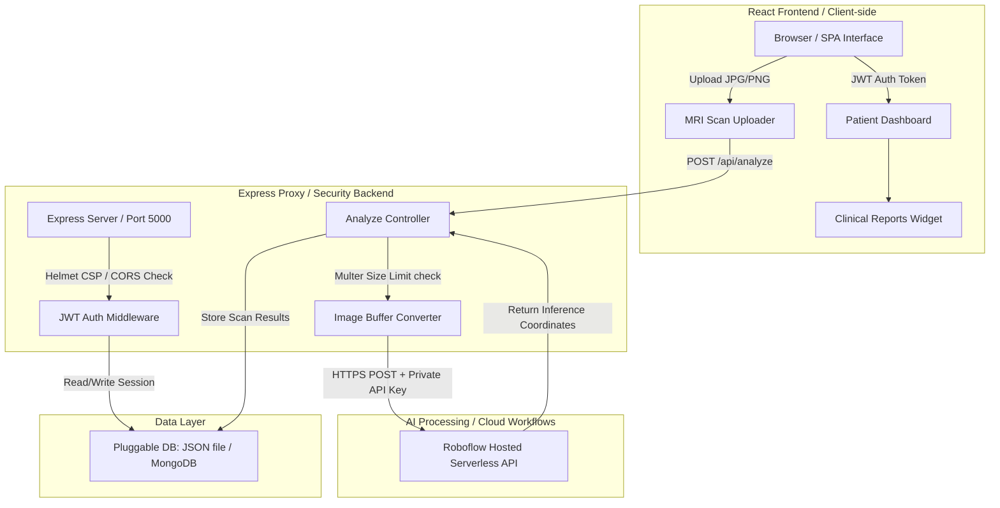

# NeuroScan AI: Secure Brain Tumor Diagnostic Assistant

NeuroScan AI is a state-of-the-art Web Application designed for clinical brain tumor detection in T1/T2-weighted MRI scans. By combining **Roboflow's serverless workflows model (RF-DET)** with a secure, role-restricted backend, NeuroScan AI provides real-time automated segmentation, physician verification sign-offs, and hospital-wide analytics dashboards.

---

## 🔬 System Architecture Diagram



---

## 📂 Folder Structure Layout

```text
NeuroScan AI/
├── backend/
│   ├── config/             # Config schema mapping system ports & Roboflow endpoints
│   ├── controllers/        # Express handlers (Auth, Admin, Scans, Analyze)
│   ├── data/               # Local JSON database seed storage fallbacks
│   ├── middleware/         # Security checks (JWT auth tokens, Upload validations)
│   ├── routes/             # REST routing groups
│   ├── services/           # Services (dbService, Roboflow API connections)
│   ├── tests/              # Unit & integration suites
│   ├── utils/              # Winston log logger instances
│   ├── uploads/            # Server temporary disk space for MRI analysis
│   └── server.js           # Server application main entry file
├── src/
│   ├── components/         # Reusable widgets (Layout, SVG charts, Error boundary)
│   ├── pages/              # SPA Screens (Login, Dashboard, Analytics, Report)
│   ├── App.tsx             # Main React Router & Session state controller
│   ├── index.css           # Global theme CSS parameters
│   └── main.tsx            # React application entry point
├── package.json            # Node project configuration
└── vite.config.ts          # Vite build, TypeScript parser, and API proxies
```

---

## 🛠 Installation Guide

### Prerequisites
* **Node.js**: Version 18.x or above.
* **NPM**: Version 9.x or above.

### Step 1: Clone and install packages
1. Navigate to the project root directory.
2. Install frontend and backend packages:
   ```bash
   # Install root and frontend packages
   npm install
   
   # Install backend packages
   cd backend
   npm install
   ```

### Step 2: Configure Environment Variables
Create a `.env` file inside the `backend/` directory:
```env
PORT=5000
NODE_ENV=production
JWT_SECRET=your-private-session-key-change-in-prod
MONGODB_URI=mongodb://localhost:27017/neuroscan   # Optional (falls back to db.json automatically)
ROBOFLOW_API_KEY=your_private_roboflow_key        # Optional (enables live AI inference)
ROBOFLOW_WORKFLOW_URL=https://serverless.roboflow.com/rajus-workspace-ddjfe/workflows/brain-tumor-mri-v3-logic
```

---

## 🚀 Running locally

### Development Mode (Concurrent dev servers)
Start the backend and frontend dev servers concurrently:
```bash
# Start backend server (from backend/ directory)
cd backend
npm run dev

# Start frontend Vite server (from root directory in a separate terminal)
npm run dev
```

### Production Build compilation
To build and serve the optimized static assets via Express:
```bash
# Compile and optimize frontend production bundles
npm run build

# Start the Express server in production mode
cd backend
NODE_ENV=production npm start
```

---

## 🧪 Testing Suite Guide

NeuroScan AI utilizes Node.js's native test runner to perform lightning-fast, dependency-free testing.

Run the unit and integration test suite:
```bash
node --test backend/tests/db.test.js backend/tests/api.test.js
```

---

## 📄 REST API Endpoint Reference

### Authentication Routes

#### `POST /api/auth/register`
* **Access**: Public
* **Request Body**:
  ```json
  {
    "name": "John Doe",
    "email": "john@clinic.org",
    "password": "securepassword",
    "role": "Patient",
    "age": 45,
    "gender": "Male"
  }
  ```
* **Response (201 Created)**: Returns the JWT Token and safe user metadata.

#### `POST /api/auth/login`
* **Access**: Public
* **Request Body**:
  ```json
  {
    "email": "patient@clinic.org",
    "password": "password123"
  }
  ```
* **Response (200 OK)**: Returns the JWT Token.

---

### Diagnosis & Analysis Routes

#### `POST /api/analyze`
* **Access**: Patient (Authenticated) or Anonymous (Optional Ingestion)
* **Headers**: `Authorization: Bearer <jwt_token>` (Optional)
* **Form Data**:
  * `image`: File (JPG, JPEG, PNG). Max 10MB limit.
* **Response (200 OK)**:
  ```json
  {
    "success": true,
    "data": {
      "hasTumor": true,
      "type": "Glioma",
      "confidence": 98.4,
      "location": { "x": 42.1, "y": 38.5, "r": 12.0 },
      "recommendation": "A clinical neuro-oncology scan review is recommended...",
      "findings": "Elevated density localized in left frontal lobe area.",
      "riskLevel": "High",
      "scanId": "NS-71932-A"
    }
  }
  ```

---

### Admin & Caseload Routes

#### `GET /api/admin/stats`
* **Access**: Administrator only
* **Headers**: `Authorization: Bearer <jwt_token>`
* **Response (200 OK)**: Returns complete system diagnostic logs, daily scan arrays, and demographic spreads.

#### `PUT /api/scans/:scanId/review`
* **Access**: Doctor only
* **Headers**: `Authorization: Bearer <jwt_token>`
* **Request Body**:
  ```json
  {
    "clinicalNotes": "Confirmed frontal meningioma. Recommended resection.",
    "doctorApproved": true
  }
  ```
* **Response (200 OK)**: Returns success sign-off flag.
